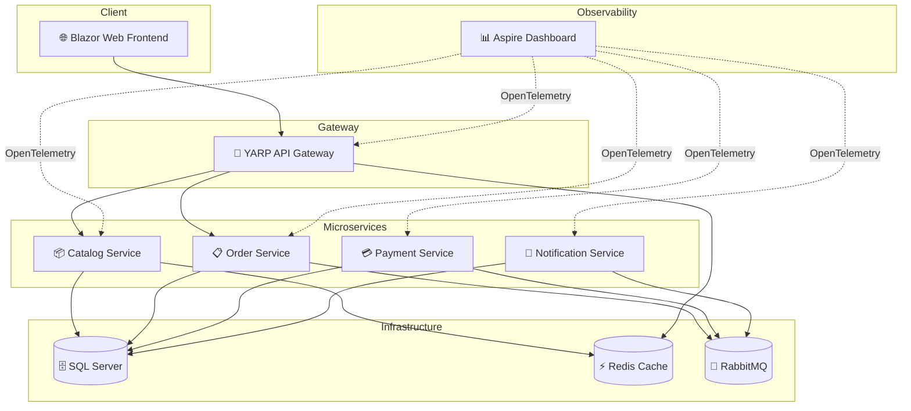
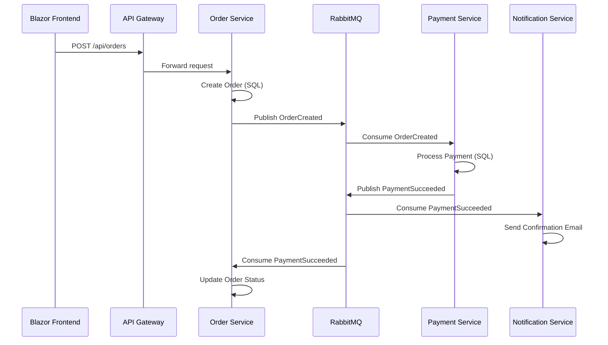

# 🛒 Aspire E-Commerce Demo

A full-featured microservices e-commerce application built with **.NET 9** and **.NET Aspire 9.1**, demonstrating cloud-native patterns, event-driven architecture, and modern distributed systems best practices.

---

## 🏗️ Architecture



### Event Flow



---

## 📋 Prerequisites

| Requirement | Version | Purpose |
|---|---|---|
| [.NET SDK](https://dotnet.microsoft.com/download) | 9.0+ | Build and run the application |
| [Docker Desktop](https://www.docker.com/products/docker-desktop/) | Latest | Container runtime for infrastructure |
| [.NET Aspire Workload](https://learn.microsoft.com/dotnet/aspire/fundamentals/setup-tooling) | 9.1+ | Aspire orchestration tooling |

### Install the Aspire workload

```bash
dotnet workload update
dotnet workload install aspire
```

### Verify installation

```bash
dotnet --list-sdks       # Should show 9.0.x
dotnet workload list     # Should show 'aspire'
docker --version         # Docker must be running
```

---

## 🚀 How to Run

### 1. Clone and navigate

```bash
cd AspireECommerceDemo
```

### 2. Launch the entire stack

```bash
dotnet run --project src/AspireECommerceDemo.AppHost
```

This single command will:
- 🗄️ Spin up **SQL Server** with 4 databases (catalog, orders, payments, notifications)
- ⚡ Start **Redis** for distributed caching
- 🐰 Launch **RabbitMQ** with management plugin
- 🚀 Boot all **4 microservices** + API Gateway + Web Frontend
- 📊 Open the **Aspire Dashboard** with full telemetry

### 3. Access the applications

| Service | URL |
|---|---|
| **Aspire Dashboard** | `https://localhost:17225` |
| **Web Frontend** | Assigned by Aspire (see dashboard) |
| **API Gateway** | Assigned by Aspire (see dashboard) |
| **RabbitMQ Management** | Assigned by Aspire (see dashboard) |

---

## 📁 Project Structure

```text
AspireECommerceDemo/
├── AspireECommerceDemo.sln          # Solution file
├── global.json                       # SDK version pinning
├── Directory.Build.props             # Common build properties
├── Directory.Packages.props          # Central package management
├── README.md
│
└── src/
    ├── AspireECommerceDemo.AppHost/           # 🎛️ Aspire orchestrator
    │   ├── AspireECommerceDemo.AppHost.csproj
    │   └── Program.cs                         #    Infrastructure + service wiring
    │
    ├── AspireECommerceDemo.ServiceDefaults/   # 🔧 Shared configuration
    │   ├── AspireECommerceDemo.ServiceDefaults.csproj
    │   └── Extensions.cs                      #    OpenTelemetry, health, resilience
    │
    ├── AspireECommerceDemo.Contracts/         # 📜 Shared message contracts
    │   ├── AspireECommerceDemo.Contracts.csproj
    │   └── Events/
    │       ├── OrderEvents.cs                 #    OrderCreated, OrderCancelled
    │       └── PaymentEvents.cs               #    PaymentSucceeded, PaymentFailed
    │
    ├── AspireECommerceDemo.CatalogService/    # 📦 Product catalog + caching
    ├── AspireECommerceDemo.OrderService/      # 📋 Order management + sagas
    ├── AspireECommerceDemo.PaymentService/    # 💳 Payment processing
    ├── AspireECommerceDemo.NotificationService/# 🔔 Event-driven notifications
    ├── AspireECommerceDemo.ApiGateway/        # 🔀 YARP reverse proxy
    └── AspireECommerceDemo.Web/              # 🌐 Blazor web frontend
```

---

## 🎯 Key Concepts Demonstrated

### .NET Aspire Fundamentals
- **App Model** — Declarative infrastructure-as-code in `Program.cs`
- **Service Discovery** — Automatic endpoint resolution between services
- **Health Checks** — `/health` and `/alive` endpoints on every service
- **OpenTelemetry** — Distributed tracing, metrics, and structured logging
- **Aspire Dashboard** — Real-time observability across all services

### Cloud-Native Patterns
- **API Gateway** — YARP reverse proxy with route-based forwarding
- **Event-Driven Architecture** — MassTransit + RabbitMQ for async messaging
- **CQRS-Lite** — Separate read/write models in the Catalog Service
- **Distributed Caching** — Redis for output caching and session state
- **Central Package Management** — Single source of truth for NuGet versions

### Resilience & Reliability
- **HTTP Resilience** — Retries, circuit breakers, timeouts via `Microsoft.Extensions.Http.Resilience`
- **WaitFor** — Ordered startup dependencies in the AppHost
- **Data Volumes** — Persistent storage for SQL Server, Redis, and RabbitMQ

---

## 🎬 Demo Scenarios

### Scenario 1: The "One Command" Experience
> Show how `dotnet run` starts the entire distributed system — databases, message brokers, caches, and all microservices.

### Scenario 2: Distributed Tracing
> Place an order and trace the request through API Gateway → Order Service → RabbitMQ → Payment Service → Notification Service using the Aspire Dashboard.

### Scenario 3: Resilience in Action
> Stop the Payment Service and watch the circuit breaker activate, then restart it and see requests resume automatically.

### Scenario 4: Live Metrics
> Open the Aspire Dashboard metrics view to see request rates, error rates, and latency percentiles across all services in real-time.

### Scenario 5: Service Discovery Magic
> Show how services reference each other by name (`catalogservice`, `orderservice`) with zero configuration — no hardcoded URLs.

---

## 🛠️ Development

### Restore packages
```bash
dotnet restore
```

### Build all projects
```bash
dotnet build
```

### Run tests
```bash
dotnet test
```

---

## 📚 Resources

- [.NET Aspire Documentation](https://learn.microsoft.com/dotnet/aspire/)
- [.NET Aspire Samples](https://github.com/dotnet/aspire-samples)
- [MassTransit Documentation](https://masstransit.io/documentation)
- [YARP Documentation](https://microsoft.github.io/reverse-proxy/)

---

## 📄 License

This project is for demonstration purposes. MIT License.
